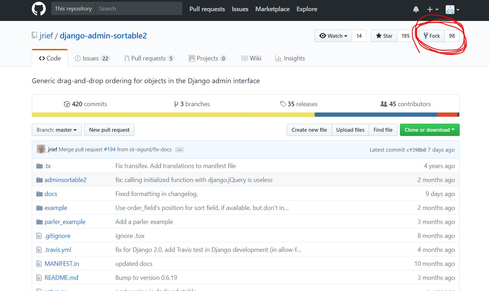
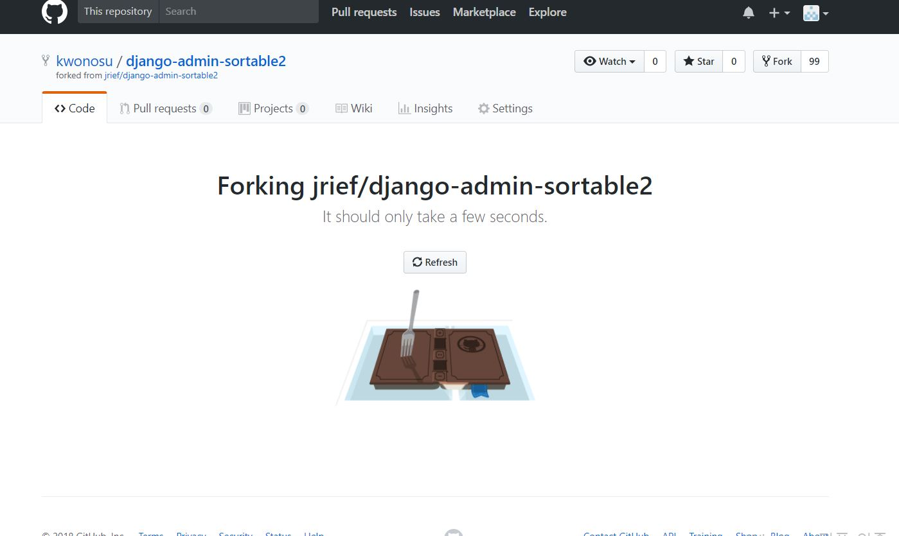
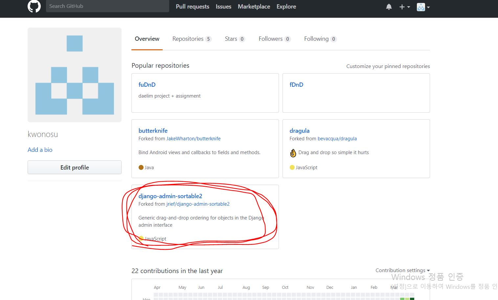
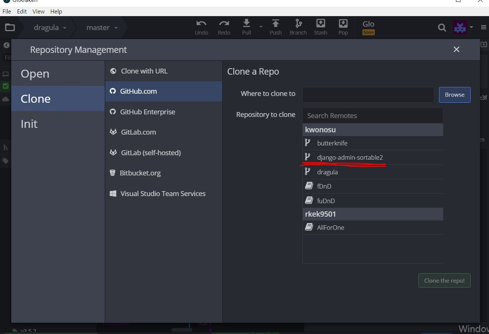
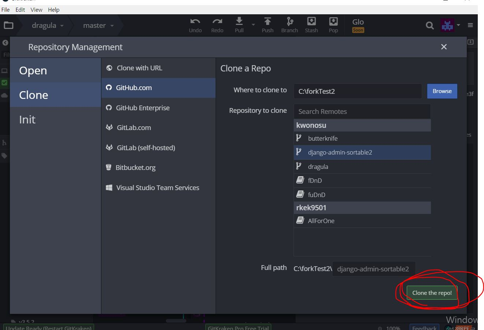
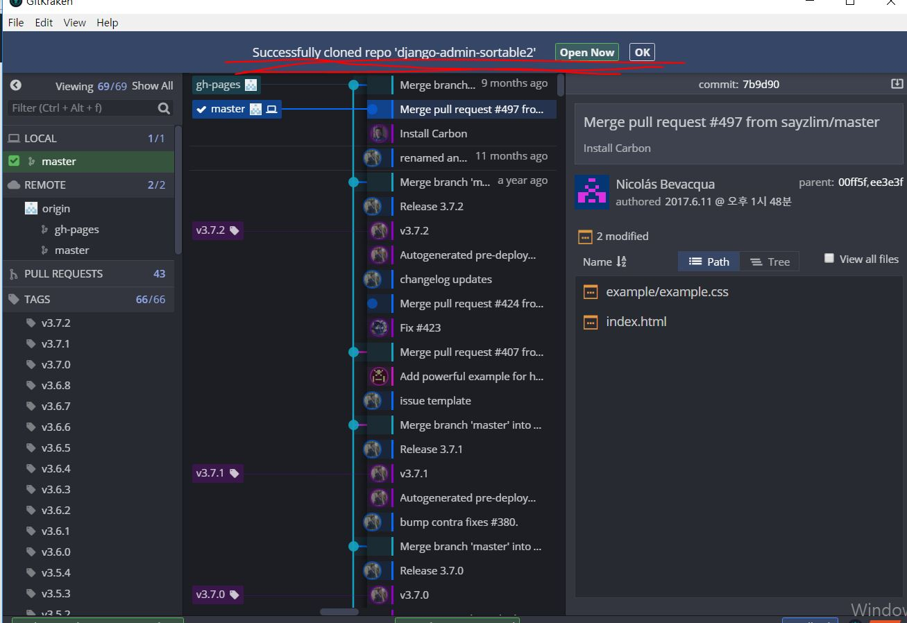

Report #2 
===========
fork하는 방법
-----------

## Fork 버튼을 누릅니다.

## Fork 진행화면

## 내 Repositories에 생성

## gitkraken에서 clone

## Repo 선택후 버튼 클릭!

## 성공!
- - -

fork한 것을 수정해서 commit을 승인하는 방법
-----------
최상위 폴더에 작성해둔다.
